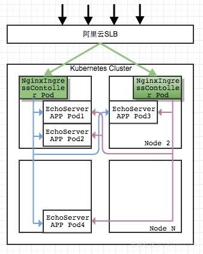
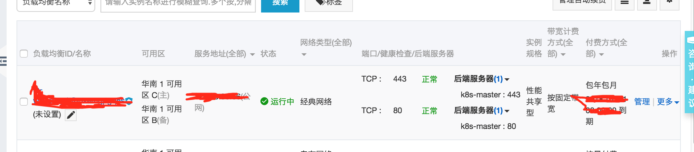

阿里云 k8s 1.10 版本安装
===========================

安装过程比较心酸，由于是阿里云上安装但是并不想使用阿里云提供的一站式解决方案，这样需要自己和阿里云盘、NAS、LBS集成，看了不少阿里云集成k8s的文章，k8s版本都比较低而，其中踩了不少坑在这里总结一下安装过程

##服务器准备说明
1. 安装的ECS系统为 centos 7.4，使用阿里VPC网络，打通所有ECS之间的SSH通道，并且能够实现公钥登录，避免安装过程中频繁输入密码。
2. 使用 172.16.0.188 做为总控机，将本例中所以文件copy到/opt目录下
3. 服务器列表：

|k8s-master|172.16.0.188|master and etcd|
|---|---|----
|k8s-slave1|172.16.0.189|node and etcd
|k8s-slave2|172.16.0.190|node and etcd


##安装etcd
使用了[玩转阿里云上Kubernetes 1.7.2 高可用部署](https://yq.aliyun.com/articles/221714?spm=a2c4e.11153940.blogcont562459.26.5a531c05GqTHSj)中的自动化部署脚本，但是由于并不支持高版本的etcd版本所以改了一下。

1.解压安装包，执行下面命令安装
```Bash
chmod 7777 kuberun.sh
./kuberun.sh --role deploy-etcd --hosts 172.16.0.188,172.16.0.189,172.16.0.190 --etcd-version v3.2.18
```
2.验证安装是成功
通过ps -eaf|grep etcd查看进程是否正常启动。
通过命令
```Bash
etcdctl --endpoints=https://172.16.0.188:2379 \
        --ca-file=/var/lib/etcd/cert/ca.pem \
        --cert-file=/var/lib/etcd/cert/etcd-client.pem \
        --key-file=/var/lib/etcd/cert/etcd-client-key.pem \
        cluster-health
```
3.如发现有问题可执行命令撤消安装
```Bash
./kuberun.sh --role destroy-etcd --hosts 172.16.0.188,172.16.0.189,172.16.0.190 --etcd-version v3.2.18
```
##安装docker
所有服务器都执行
```Bash
curl -O https://yum.dockerproject.org/repo/main/centos/7/Packages/docker-engine-17.03.0.ce-1.el7.centos.x86_64.rpm
yum localinstall -y docker-engine-17.03.0.ce-1.el7.centos.x86_64.rpm

sed -i '$a net.bridge.bridge-nf-call-iptables = 1' /usr/lib/sysctl.d/00-system.conf
echo 1 > /proc/sys/net/bridge/bridge-nf-call-iptables
iptables -P FORWARD ACCEPT
sed -i "/ExecStart=/a\ExecStartPost=/usr/sbin/iptables -P FORWARD ACCEPT" /lib/systemd/system/docker.service
systemctl daemon-reload ; systemctl enable  docker.service; systemctl restart docker.service
```

##部署master
1.安装kubernetes master组件

组件为kubeadm、kubectl、kubectl、kubernetes-cni，由于有墙无法通过Yum源的方式安装，需要手动下载需要版本的rmp文件进行安装。

本例中提供 1.10版本rpm,安装包下载完成后执行:
```Bash
cd kubernetes
yum install socat
yum localinstall -y *
```

2.启动前准备
```Bash
systemctl stop firewalld
systemctl disable firewalld

swapoff -a 
sed -i 's/.*swap.*/#&/' /etc/fstab

setenforce  0 
sed -i "s/^SELINUX=enforcing/SELINUX=disabled/g" /etc/sysconfig/selinux 
sed -i "s/^SELINUX=enforcing/SELINUX=disabled/g" /etc/selinux/config 
sed -i "s/^SELINUX=permissive/SELINUX=disabled/g" /etc/sysconfig/selinux 
sed -i "s/^SELINUX=permissive/SELINUX=disabled/g" /etc/selinux/config  
```

3.由于墙docker 无法下载官方image,可以去阿里云docker仓库下载改成官方版本。

这里提供是1.10版本的docker image
```Bash
docker pull registry.cn-hangzhou.aliyuncs.com/google_containers/kube-apiserver-amd64:v1.10.0
docker tag registry.cn-hangzhou.aliyuncs.com/google_containers/kube-apiserver-amd64:v1.10.0 k8s.gcr.io/kube-apiserver-amd64:v1.10.0

docker pull registry.cn-hangzhou.aliyuncs.com/google_containers/kube-controller-manager-amd64:v1.10.0
docker tag registry.cn-hangzhou.aliyuncs.com/google_containers/kube-controller-manager-amd64:v1.10.0 k8s.gcr.io/kube-controller-manager-amd64:v1.10.0

docker pull registry.cn-hangzhou.aliyuncs.com/google_containers/kube-scheduler-amd64:v1.10.0
docker tag registry.cn-hangzhou.aliyuncs.com/google_containers/kube-scheduler-amd64:v1.10.0 k8s.gcr.io/kube-scheduler-amd64:v1.10.0

docker pull registry.cn-hangzhou.aliyuncs.com/google_containers/etcd-amd64:3.1.12
docker tag registry.cn-hangzhou.aliyuncs.com/google_containers/etcd-amd64:3.1.12 k8s.gcr.io/etcd-amd64:3.1.12

docker pull registry.cn-hangzhou.aliyuncs.com/google_containers/pause-amd64:3.1
docker tag registry.cn-hangzhou.aliyuncs.com/google_containers/pause-amd64:3.1 k8s.gcr.io/pause-amd64:3.1

docker pull registry.cn-hangzhou.aliyuncs.com/google_containers/k8s-dns-dnsmasq-nanny-amd64:1.14.5
docker tag registry.cn-hangzhou.aliyuncs.com/google_containers/k8s-dns-dnsmasq-nanny-amd64:1.14.5 k8s.gcr.io/k8s-dns-dnsmasq-nanny-amd64:1.14.5

docker pull registry.cn-hangzhou.aliyuncs.com/google_containers/k8s-dns-kube-dns-amd64:1.14.5
docker tag registry.cn-hangzhou.aliyuncs.com/google_containers/k8s-dns-kube-dns-amd64:1.14.5 k8s.gcr.io/k8s-dns-kube-dns-amd64:1.14.5

docker pull registry.cn-hangzhou.aliyuncs.com/google_containers/k8s-dns-sidecar-amd64:1.14.5
docker tag registry.cn-hangzhou.aliyuncs.com/google_containers/k8s-dns-sidecar-amd64:1.14.5 k8s.gcr.io/k8s-dns-sidecar-amd64:1.14.5

docker pull registry.cn-hangzhou.aliyuncs.com/google-containers/flannel:v0.9.0-amd64
docker tag registry.cn-hangzhou.aliyuncs.com/google-containers/flannel:v0.9.0-amd64 quay.io/coreos/flannel:v0.9.0-amd64
```

4.修改kubelet配置文件
```Bash
vi /etc/systemd/system/kubelet.service.d/10-kubeadm.conf

修改这一行
Environment="KUBELET_CGROUP_ARGS=--cgroup-driver=cgroupfs"

添加下面这行，为支持阿里云云盘插件停用enable-controller-attach-detach
Environment="KUBELET_ALIYUN=--enable-controller-attach-detach=false"

在执行命令添加 $KUBELET_ALIYUN
ExecStart=/usr/bin/kubelet $KUBELET_KUBECONFIG_ARGS $KUBELET_SYSTEM_PODS_ARGS $KUBELET_NETWORK_ARGS $KUBELET_DNS_ARGS $KUBELET_AUTHZ_ARGS $KUBELET_CADVISOR_ARGS $KUBELET_CGROUP_ARGS $KUBELET_CERTIFICATE_ARGS $KUBELET_EXTRA_ARGS $KUBELET_ALIYUN
```
执行
```Bash
systemctl daemon-reload
systemctl enable kubelet
```

5.编写kubernetes 初始化配置文件
将配置文件保存在/etc/kubeadm/kubeadm.cfg
```Yaml
apiVersion: kubeadm.k8s.io/v1alpha1
kind: MasterConfiguration
networking:
  dnsDomain: cluster.local
  serviceSubnet: 10.19.0.0/16
  podSubnet: 10.16.0.0/16
kubernetesVersion: v1.10.0
etcd:
  endpoints:
  - https://172.16.0.188:2379
  - https://172.16.0.189:2379
  - https://172.16.0.190:2379
  caFile: /etc/kubernetes/pki/etcd/ca.pem
  certFile: /etc/kubernetes/pki/etcd/etcd-client.pem
  keyFile: /etc/kubernetes/pki/etcd/etcd-client-key.pem
apiServerCertSANs:
  - 172.16.0.188
  - 172.16.0.189
  - 172.16.0.190
```
6.执行初始化kubernetes 指令
```Bash
mkdir -p /etc/kubernetes/pki/etcd/
cp -rf /var/lib/etcd/cert/{ca.pem,etcd-client.pem,etcd-client-key.pem} /etc/kubernetes/pki/etcd/
kubeadm init --config=/etc/kubeadm/kubeadm.cfg
```
如果执行成功，请根据提示执行相关命令设置环境
```Bash
mkdir -p $HOME/.kube
sudo cp -i /etc/kubernetes/admin.conf $HOME/.kube/config
sudo chown $(id -u):$(id -g) $HOME/.kube/config
```
如果执行失败，可以执行kubeadm reset回滚，修改配制后再执行上面的命令
7.执行DNS配制，解决无法解析公网DNS问题
```Bash
kubectl create -f kube-dns.yaml
```
8.本例使用flannel作为网络组件,Yaml文件安装包提供
```Bash
kubectl apply -f flannel.yml
```
9.部署dashboard
```Bash
kubectl create -f dashboard.yaml
```
获取token,通过令牌登陆
```Bash
kubectl -n kube-system describe secret $(kubectl -n kube-system get secret | grep admin-user | awk '{print $1}')
```
通过浏览器访问dashboard，输入token,即可登陆
```Url
https://IP:30000/#!/login
```
10.安装heapster
```Bash
kubectl create -f kube-heapster/influxdb/
```
11.让master也运行pod（默认master不运行pod）
```Bash
kubectl taint nodes --all node-role.kubernetes.io/master-
```
12.安装阿里云盘插件，引用[阿里云官网教程](https://help.aliyun.com/document_detail/63955.html?spm=a2c4e.11153940.blogcont495754.15.b69131fePn6YpD)
新建/etc/kubernetes/cloud-config文件,写入阿里云相关配制
```Bash
vi /etc/kubernetes/cloud-config
{
    "global": {
     "accessKeyID": "阿里云accessKeyID",
     "accessKeySecret": "阿里云accessKeySecret"
   }
}
```
执行安装插件
```Bash
kubectl create -f aliyun-disk.yaml
kubectl create -f aliyun-flex.yaml
kubectl create -f aliyun-nas-cotroller.yaml
```
##七层负载均衡的支持
本方案采用ingress进行七层负载均衡，也采用阿里云的SLB做请求入口，有别于阿里云官方方案的地方是我们并不使用阿里的load balancer，我是手动创建slb配制tcp端口80、443透传到nginx-ingress-controller部署机器。

关于不用阿里云的load balancer我的思考如下：

1. 自动创建SLB感觉太费钱对于费用不好控制（小公司必须要考虑）；
2. 不是使用阿里云提供的一站式解决方案，必要自己配制load balancer的支持，这里吐槽一下阿里云，对于想自己搭建k8s环境的用户来说支持的非常差劲，文档例子非常少也不完全，碰到问题我都是自己看源码才能解决；

下图为七层负载均衡架构图，[引用自阿里云](https://yq.aliyun.com/articles/69580?spm=a2c4e.11153940.blogcont562459.28.13ed1c05LVe7jY)



1.安装 ingress-nginx

[安装yaml全部为github拉取](https://github.com/kubernetes/ingress-nginx/tree/master/deploy)，只对 with-rbac.yaml 做了修改：
```Yaml
#添加了使用Node网络，会使用部署的Node节点中80和443端口   
hostNetwork: true
```
执行
```Bash
kubectl create -f ingress-nginx/namespace.yaml
kubectl create -f ingress-nginx/configmap.yaml
kubectl create -f ingress-nginx/default-backend.yaml
kubectl create -f ingress-nginx/tcp-services-configmap.yaml
kubectl create -f ingress-nginx/udp-services-configmap.yaml
kubectl create -f ingress-nginx/rbac.yaml
kubectl create -f ingress-nginx/with-rbac.yaml
```

这里有个问题，nginx-ingress-controller是一个单点，应该可以改成多点，使用 nodeSelector运行在指令的node上

2.设置阿里云SLB方式做对外服务，映射 tcp 80 和443 到master节点



3.拿dashboard做个实验

创建一个dashboard-ingress，采用Https协议访问，[先设置kubernetes-dashboard-certs证书](证书说明.md)，然后执行命令
```Bash
kubectl create -f ingress-nginx/dashboard-ingress.yml
```
##添加一个Node
请参照master安装

1.安装docker

2.安装kubeadm、kubectl、kubectl、kubernetes-cni

3.执行启动前准备

4.拉取docker image

5.修改kubelet配置文件，这里需要追加一处修改
```Bash
#把执行命令中的 $KUBELET_NETWORK_ARGS 删除，不启用 network-plugin=cni
ExecStart=/usr/bin/kubelet $KUBELET_KUBECONFIG_ARGS $KUBELET_SYSTEM_PODS_ARGS $KUBELET_DNS_ARGS $KUBELET_AUTHZ_ARGS $KUBELET_CADVISOR_ARGS $KUBELET_CGROUP_ARGS $KUBELET_CERTIFICATE_ARGS $KUBELET_EXTRA_ARGS $KUBELET_ALIYUN
```

6.执行命令加入node

在初始化master的命令 kubeadm init --config=/etc/kubeadm/kubeadm.cfg 执行成功后会提示如下的加入命令，在node运行就加入集群
```Bash
kubeadm join 192.168.150.186:6443 --token b99a00.a144ef80536d4344 --discovery-token-ca-cert-hash sha256:f79b68fb698c92b9336474eb3bf184e847f967dc58a6296911892662b98b1315
```